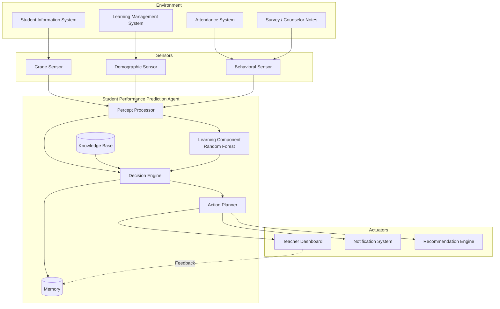
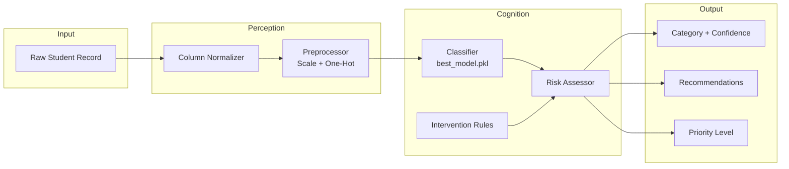
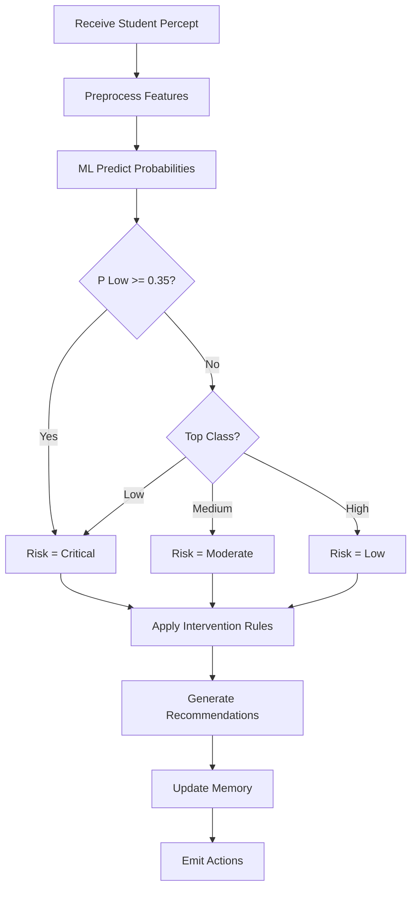
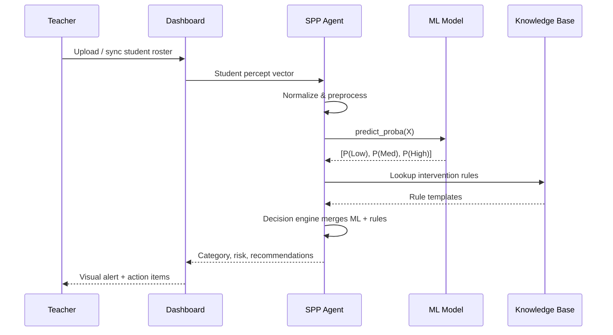
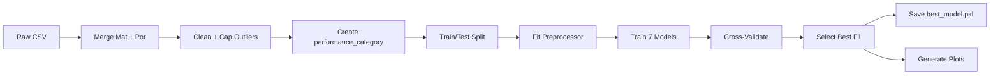

# AI Agent Design — Student Performance Prediction Agent

## 1. Agent Identity

| Attribute | Value |
|-----------|-------|
| **Name** | Student Performance Prediction Agent (SPPA) |
| **Type** | Learning + Knowledge-Based Hybrid Agent |
| **Goal** | Predict academic performance category and recommend timely interventions |
| **Environment** | Secondary school educational ecosystem |
| **Users** | Teachers, counselors, administrators, parents |

---

## 2. PEAS Description

| Component | Description |
|-----------|-------------|
| **Performance** | Maximize early detection of at-risk students; minimize false negatives |
| **Environment** | School information systems, classrooms, homes, examination periods |
| **Actuators** | Dashboard alerts, notification emails, tutoring referrals, parent conferences |
| **Sensors** | SIS records, LMS logs, attendance scanners, survey forms, grade books |

---

## 3. System Architecture



---

## 4. AI Agent Architecture (Internal)



---

## 5. Component Specifications

### 5.1 Percepts
Structured observations about a student at time *t*:
- Demographics: age, sex, address, family size
- Academic history: G1, G2, failures, study time
- Support factors: school support, family support, internet access
- Behavioral: absences, alcohol consumption, free time, health

### 5.2 Sensors
| Sensor | Data Source | Percepts Produced |
|--------|-------------|-------------------|
| Academic | Grade book API | G1, G2, failures |
| Attendance | RFID / manual logs | absences |
| Demographic | Enrollment forms | age, sex, parental education |
| Engagement | LMS analytics | study time proxies, activity flags |

### 5.3 Knowledge Base
Static and dynamic knowledge:
- **Performance thresholds**: Low (G3&lt;10), Medium (10–13), High (≥14)
- **Intervention rules**: category-specific action templates
- **Feature semantics**: UCI attribute definitions
- **Policy constraints**: privacy rules, escalation procedures

### 5.4 Learning Component
- **Algorithm**: Random Forest Classifier (200 trees, max_depth=12)
- **Training**: Supervised learning on 1,044 labeled student records
- **Input**: 32+ encoded features after preprocessing
- **Output**: P(Low), P(Medium), P(High)
- **Persistence**: `models/best_model.pkl` via Joblib

### 5.5 Decision Engine
Hybrid reasoning combining ML and rules:

1. **Classification**: `argmax(P(category))` from Random Forest
2. **Risk escalation**: If P(Low) ≥ 0.35, elevate risk regardless of top class
3. **Rule augmentation**: Append feature-specific recommendations (high absences, low study time)
4. **Priority assignment**: HIGH / MEDIUM / LOW intervention queue



### 5.6 Memory
- **Short-term**: Current batch of students being scored
- **Long-term**: Per-student prediction history (`agent.memory` dict)
- **Episodic**: Timestamped interventions and outcomes (future extension)

### 5.7 Actions
| Action | Trigger | Recipient |
|--------|---------|-----------|
| Dashboard update | Any prediction | Teacher |
| High-priority alert | Low + Critical risk | Counselor |
| Parent notification | Low performance | Parents (with consent) |
| Tutoring referral | failures ≥ 2 | Academic support office |
| Enrichment offer | High performance | Student |

---

## 6. Prediction Flow



---

## 7. Training Pipeline



---

## 8. Teacher Interaction

Teachers interact through:
1. **Batch dashboard** (`python main.py --dashboard`) — scores entire cohort
2. **Single-student query** — API or CLI demo
3. **Feedback loop** — teacher marks false alarms; data stored for retraining (future)

The agent **assists** teachers; it does not autonomously change grades or enforce disciplinary action.

---

## 9. Student Interaction

Students receive indirect benefits:
- Earlier support before failure
- Personalized study recommendations
- Privacy-preserving aggregation (no public ranking)

Direct student-facing features (future): mobile app showing study tips based on agent recommendations.

---

## 10. Feedback Loop

```
Predict → Act (intervene) → Observe outcome (next G1/G2/G3) → Store in Memory → Retrain periodically
```

This closes the **rational agent** cycle: the agent improves as more labeled outcomes become available.

---

## 11. Implementation Mapping

| Design Component | Code Location |
|------------------|---------------|
| Percept normalization | `src/utils.py` → `normalize_column_names()` |
| Preprocessing | `src/preprocess.py` |
| Learning component | `src/train.py` → Random Forest in `best_model.pkl` |
| Decision engine | `src/predict.py` → `StudentPerformanceAgent` |
| Knowledge base | `src/predict.py` → `INTERVENTION_RULES` |
| Memory | `src/predict.py` → `self.memory` |
| Actions / dashboard | `main.py --dashboard`, `outputs/teacher_dashboard.csv` |

---

## 12. Why This Is a True AI Agent

A standalone `model.predict()` call is **machine learning**. Our system exhibits **agency**:

1. **Autonomy**: Processes cohorts without per-student manual configuration
2. **Reactivity**: Responds to new student percepts in milliseconds
3. **Pro-activeness**: Recommends interventions before exams
4. **Social ability** (future): Multi-agent coordination with counselors and parents

The ML model provides **beliefs** about student state; the decision engine converts beliefs into **actions** — the defining characteristic of an intelligent agent per Russell & Norvig.
